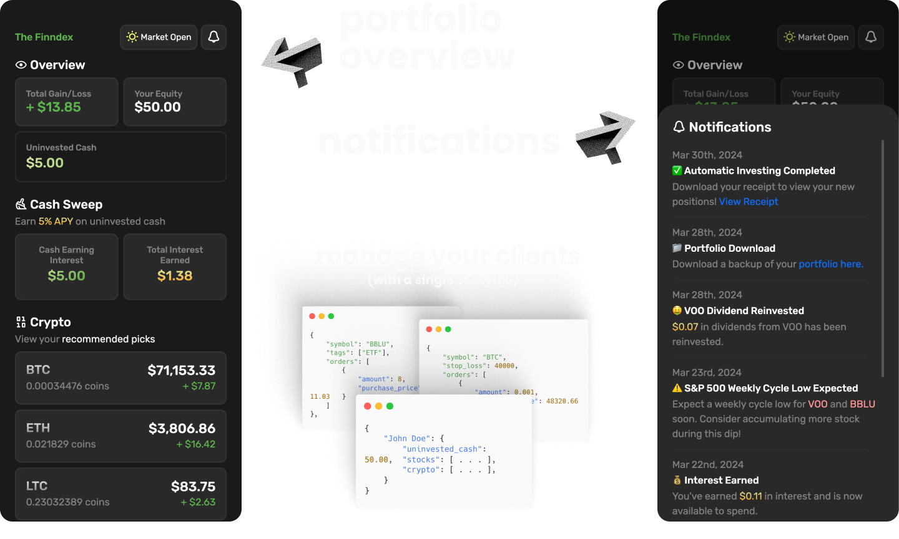

# The Finndex
Ever wanted to become your own broker?

The Finndex is a simple stock and crypto price tracking app with complex functionality allowing you to manage either your own portfolio, or your friends.



### Features
- **Portfolio Overview:** Keep track of your overall profit/loss, equity, and remaining uninvested cash
- **Cash Sweep:** Keep track of earned interest (APY) from uninvested cash via your broker
- **Notifications:** Give your users custom notifications about their portfolio
- **Stock Recommendation Page:** Use CSV files the to display top rated stocks for your users.

### Run it yourself
Make sure you've updated `configuration.php` first!

```sh
$ php -S localhost:8080
```
